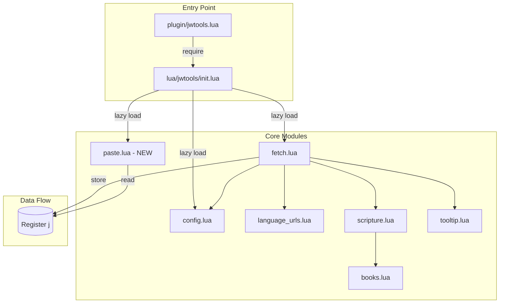

# Detailed Design: Scripture Paste Feature

## Overview

This document describes the design for adding scripture yank/paste functionality to the JWTools.nvim plugin. The feature allows users to fetch scripture from JW.org, store it in a named Vim register, and paste it at their cursor position.

## Detailed Requirements

### Configuration
- `setup()` accepts an options table with:
  - `keymaps` (boolean, default: `true`) - enables/disables default keymaps
  - `language` (string, default: `"es"`) - default scripture language

### Keymaps (when enabled)
| Keymap | Function | Description |
|--------|----------|-------------|
| `<leader>jf` | Fetch | Show tooltip AND yank to register `j` |
| `<leader>jy` | Yank | Yank to register `j` only (no tooltip), show notification |
| `<leader>jp` | Paste | Paste from register `j` at cursor (or replace visual selection) |
| `<leader>jl` | Language | Interactive language selection prompt |

### Paste Format
```
**Citation**

verse content
```

Example:
```
**Genesis 1:1**

In the beginning God created the heavens and the earth.
```

### Error Handling
- Network failure: Show error notification
- Invalid/not found scripture: Show error notification
- Empty register on paste: Show warning with instructions

### Removed Features
- `JWToolsSetJWLanguage` command (replaced by `<leader>jl` keymap)

## Architecture Overview



## Components and Interfaces

### 1. config.lua (Modified)

**Purpose**: Store plugin configuration with new options.

```lua
-- Default settings
Config.settings = {
    language = "es",
    keymaps = true,
}

-- New function to merge user options
function Config.setup(opts)
    opts = opts or {}
    for key, value in pairs(opts) do
        if Config.settings[key] ~= nil then
            Config.settings[key] = value
        end
    end
end
```

### 2. init.lua (Modified)

**Purpose**: Plugin entry point with setup configuration and keymap registration.

```lua
function M.setup(opts)
    if M.didsetup then
        return vim.notify("JWTools already setup!")
    end
    M.didsetup = true
    
    -- Apply configuration
    M.config.setup(opts)
    
    -- Register keymaps if enabled
    if M.config.get("keymaps") then
        M.register_keymaps()
    end
end

function M.register_keymaps()
    vim.keymap.set("n", "<leader>jf", M.fetch.fetch_scripture, { desc = "JWTools: Fetch scripture" })
    vim.keymap.set("n", "<leader>jy", M.fetch.yank_scripture, { desc = "JWTools: Yank scripture" })
    vim.keymap.set({"n", "v"}, "<leader>jp", M.paste.paste_scripture, { desc = "JWTools: Paste scripture" })
    vim.keymap.set("n", "<leader>jl", M.select_language, { desc = "JWTools: Select language" })
end

function M.select_language()
    local languages = { "es", "en" }
    vim.ui.select(languages, {
        prompt = "Select language:",
    }, function(choice)
        if choice then
            M.config.set("language", choice)
            vim.notify("JWTools language set to: " .. choice)
        end
    end)
end
```

### 3. fetch.lua (Modified)

**Purpose**: Scripture fetching with optional tooltip and register storage.

**Interface Changes**:
```lua
-- Existing (modified)
function M.fetch_scripture()
    -- Fetches scripture, shows tooltip, AND stores in register
end

-- New
function M.yank_scripture()
    -- Fetches scripture, stores in register, shows notification (no tooltip)
end

-- Internal helper
local function store_in_register(citation, content)
    local formatted = string.format("**%s**\n\n%s", citation, content)
    vim.fn.setreg("j", formatted)
end

-- Internal helper (extracted from tooltip.lua logic)
local function format_verse_content(json, ref_id)
    -- Returns { citation = "...", content = "..." }
end
```

**Refactored fetch flow**:
```lua
local function fetch_scripture_internal(opts)
    opts = opts or {}
    local show_tooltip = opts.show_tooltip ~= false  -- default true
    local show_notification = opts.show_notification or false
    
    -- ... existing cursor/line/ref_id logic ...
    
    vim.fn.jobstart({ "curl", ... }, {
        on_stdout = function(_, data)
            -- ... existing json parsing ...
            
            local formatted = format_verse_content(json, ref_id)
            store_in_register(formatted.citation, formatted.content)
            
            if show_tooltip then
                tooltip.show_verse_tooltip(ref_id, json)
            end
            
            if show_notification then
                vim.notify(formatted.citation .. " yanked")
            end
        end,
        on_stderr = function(_, data)
            -- Handle network errors
            vim.notify("Failed to fetch scripture", vim.log.levels.ERROR)
        end,
    })
end

function M.fetch_scripture()
    fetch_scripture_internal({ show_tooltip = true })
end

function M.yank_scripture()
    fetch_scripture_internal({ show_tooltip = false, show_notification = true })
end
```

### 4. paste.lua (New Module)

**Purpose**: Handle pasting scripture from register with mode awareness.

```lua
local M = {}

function M.paste_scripture()
    local content = vim.fn.getreg("j")
    
    if content == "" then
        vim.notify(
            "No scripture in register. Use <leader>jf or <leader>jy first.",
            vim.log.levels.WARN
        )
        return
    end
    
    local mode = vim.fn.mode()
    
    if mode == "v" or mode == "V" or mode == "\22" then  -- visual modes
        -- Delete selection and insert content
        vim.cmd('normal! "_d')
        vim.api.nvim_put(vim.split(content, "\n"), "c", true, true)
    else
        -- Normal mode: insert at cursor
        vim.api.nvim_put(vim.split(content, "\n"), "c", true, true)
    end
end

return M
```

### 5. tooltip.lua (Unchanged)

The tooltip module remains unchanged. Text formatting logic is duplicated in fetch.lua for simplicity, as the formatting requirements differ (tooltip has word wrapping, register format uses markdown bold).

## Data Models

### Configuration Schema
```lua
{
    language = "es" | "en",  -- string, default "es"
    keymaps = true | false,  -- boolean, default true
}
```

### Register Content Format
Plain text string:
```
**{Citation}**

{Verse content with HTML stripped, spaces normalized}
```

### API Response (from JW.org)
```lua
{
    ranges = {
        [ref_id] = {
            citation = "Book Chapter:Verse",  -- may contain &nbsp;
            verses = {
                { content = "<p>HTML content</p>" },
                ...
            }
        }
    }
}
```

## Error Handling

| Scenario | Handler | User Feedback |
|----------|---------|---------------|
| No scripture reference at cursor | `scripture.get_reference_id()` | "No valid scripture reference found" |
| Unsupported language | `language_urls.get_url()` | "Unsupported language: {lang}" |
| Network failure | `fetch.lua` on_stderr | "Failed to fetch scripture" |
| Scripture not found in API | `fetch.lua` on_stdout | "Scripture not found" |
| Empty register on paste | `paste.paste_scripture()` | "No scripture in register. Use <leader>jf or <leader>jy first." |

## Testing Strategy

### Unit Tests
1. **config.lua**: Test `setup()` merges options correctly
2. **paste.lua**: Test empty register handling
3. **fetch.lua**: Test `format_verse_content()` output format

### Integration Tests
1. Full fetch → register → paste flow
2. Language selection updates config
3. Keymaps disabled when `keymaps = false`

### Manual Testing
1. `<leader>jf` on valid reference → tooltip shown + register populated
2. `<leader>jy` on valid reference → notification shown + register populated
3. `<leader>jp` in normal mode → text inserted at cursor
4. `<leader>jp` in visual mode → selection replaced
5. `<leader>jl` → language picker shown

## Appendices

### Technology Choices

| Choice | Rationale |
|--------|-----------|
| Named register `j` | Doesn't interfere with clipboard or yank register |
| `vim.ui.select` for language | Native Neovim UI, integrates with user's UI preferences (telescope, fzf, etc.) |
| `vim.api.nvim_put` for paste | Handles multiline text correctly, respects cursor position |

### Alternative Approaches Considered

1. **Store in plugin variable vs register**: Register chosen because it integrates with Vim's native `"jp` paste and persists across buffer changes.

2. **Single fetch function with options vs separate functions**: Separate functions (`fetch_scripture`, `yank_scripture`) chosen for cleaner API and simpler keymap setup.

3. **Extract formatting to shared module**: Decided against this as tooltip formatting (word wrap) differs from register formatting (markdown bold). Duplication is minimal and intentional.

### Known Limitations

1. **Multiple verse ranges**: Currently broken (regression from previous refactor). To be fixed after this feature is complete.

2. **Languages**: Only `es` and `en` supported. Adding more requires updates to `language_urls.lua` and `books.lua`.
