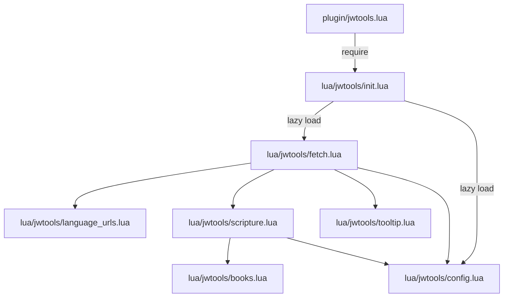

# Existing Code Analysis

## Current Architecture



## Module Responsibilities

### init.lua
- Entry point with lazy-loading via `__index` metatable
- `setup()` function creates user commands:
  - `JWToolsFetchScripture` - calls `fetch.fetch_scripture`
  - `JWToolsSetJWLanguage` - sets language via config (to be removed)
- Currently takes no arguments

### config.lua
- Simple key-value store for settings
- Default: `{ language = "es" }`
- Methods: `get(key)`, `set(key, value)`

### fetch.lua
- Main fetch logic with async curl job
- Shows spinner during fetch
- Calls `tooltip.show_verse_tooltip()` on success
- Dependencies: config, language_urls, scripture, tooltip

### tooltip.lua
- `show_verse_tooltip(ref_id, json)` - displays floating window
- Extracts citation from `json.ranges[ref_id].citation`
- Extracts verse content from `json.ranges[ref_id].verses`
- Cleans HTML tags, handles word wrapping

### scripture.lua
- `get_reference_id(line, cursor_pos)` - parses scripture reference
- Returns reference ID format: `{book_num}{chapter:03d}{verse:03d}`
- Example: Genesis 1:1 → "1001001"

### language_urls.lua
- URL patterns per language (es, en)
- `get_url(language, ref_id)` - builds API URL

### books.lua
- Book name variations per language
- Book numbers (1-66) mapped by abbreviation
- `resolve_book_name()`, `get_book_number()`, `get_book_name()`

## Data Flow for Fetch

1. User triggers `JWToolsFetchScripture`
2. `fetch.fetch_scripture()` gets cursor position and current line
3. `scripture.get_reference_id()` parses reference → ref_id
4. `language_urls.get_url()` builds API URL
5. Async curl fetches JSON
6. `tooltip.show_verse_tooltip()` displays result

## Key Data Structures

### API Response (json)
```lua
{
  ranges = {
    ["ref_id"] = {
      citation = "Genesis 1:1",  -- with &nbsp; entities
      verses = {
        { content = "<p>verse text with HTML</p>" },
        -- ...
      }
    }
  }
}
```

## Changes Needed

1. **init.lua**: 
   - Accept config options in `setup(opts)`
   - Register keymaps if enabled
   - Remove `JWToolsSetJWLanguage` command
   - Add new commands for yank, paste, language select

2. **config.lua**:
   - Add `keymaps` setting (default: true)
   - Keep `language` setting (default: "es")

3. **fetch.lua**:
   - Accept optional `show_tooltip` parameter
   - Store formatted scripture in register after fetch
   - Add `yank_scripture()` function (no tooltip)

4. **tooltip.lua** or new module:
   - Extract text formatting logic to be reusable
   - Format as `**Citation**\n\nverse content`

5. **New paste module or function**:
   - Read from register `j`
   - Handle normal mode (insert at cursor)
   - Handle visual mode (replace selection)
