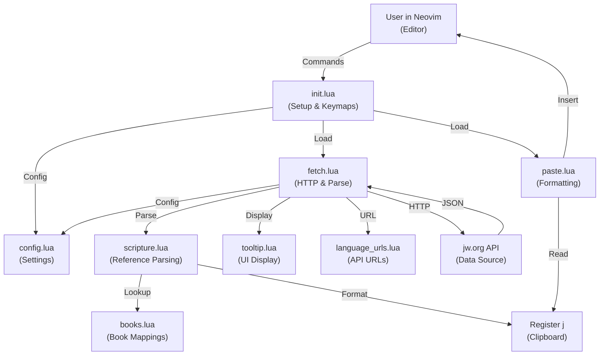

# Architecture

## System Architecture Overview



## Component Interaction Flow

### Scripture Fetch Workflow

1. **User triggers**: `<leader>jf` → calls `fetch.fetch_scripture()`
2. **Scripture detection**: `scripture.lua` parses line at cursor for Bible references
3. **Book validation**: `books.lua` normalizes book names and abbreviations
4. **Cookie management**: Ensures valid jw.org session cookies
5. **URL construction**: `language_urls.lua` builds API endpoint with current language
6. **HTTP request**: `curl` fetches JSON from jw.org (async via jobstart)
7. **Response parsing**: Extracts verse content and metadata
8. **Tooltip display**: `tooltip.lua` renders floating window with formatted verses
9. **Register storage**: Formatted scripture (citation + content) stored in register "j"

### Scripture Paste Workflow

1. **User triggers**: `<leader>jp` (normal or visual mode)
2. **Register read**: Retrieves stored scripture from register "j"
3. **Format decision**: 
   - Normal mode: Creates markdown blockquote
   - Visual mode: Replaces selection with blockquote
4. **Text wrapping**: Wraps long lines to respect `textwidth`
5. **Insertion**: Pastes formatted blockquote at cursor position

## Design Principles

### Modularity
- Each feature in separate file with minimal interdependencies
- Clean module interface via return statements
- No global state except config

### Lua-first
- Minimal external dependencies (only curl)
- Pure Lua string/table operations
- Leverage Neovim's Lua API

### Non-blocking Operations
- HTTP requests via `vim.fn.jobstart()` (async)
- UI updates scheduled via `vim.schedule()`
- Spinner animation during network requests

### Configuration Centralization
- Single `config.lua` for all settings
- Runtime language switching without restart
- Notification-based feedback

## Data Flow Patterns

### Register-based Communication
```
Scripture Content Flow:
scripture.lua → Register j → paste.lua → Neovim Buffer
```

### Async Request Handling
```
User Action
    ↓
Register Spinner
    ↓
Spawn curl Job (background)
    ↓
Parse JSON Response (vim.schedule)
    ↓
Display Tooltip
    ↓
Store in Register j
```

## Extension Points

1. **Add Languages**: Extend `language_urls.lua` and `books.lua`
2. **Modify Output**: Change formatting in `paste.lua`
3. **Custom Keymaps**: Override or add mappings in user config
4. **UI Customization**: Modify tooltip display in `tooltip.lua`

## API Integration

### jw.org JSON Structure
```lua
{
  ranges = {
    [ref_id] = {
      citation = "Reference text",
      verses = {
        { content = "Verse 1..." },
        { content = "Verse 2..." }
      }
    }
  }
}
```

### Register Format
```
**Citation**

Content text here...
```

This format enables both tooltip display and markdown blockquote formatting.
