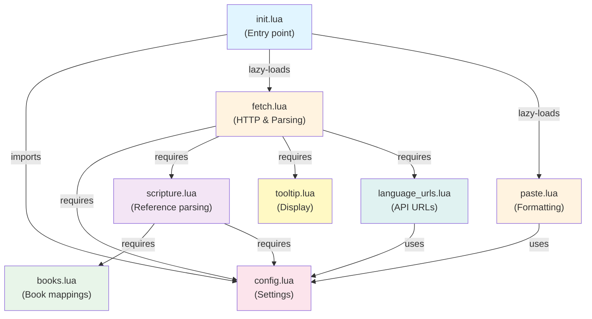

# Dependencies

## External Dependencies

### System Dependencies

#### curl
- **Purpose**: HTTP client for fetching scripture from jw.org
- **Usage**: Called via `vim.fn.jobstart()` as background process
- **Version**: Any recent version (uses standard flags)
- **Install**: Usually pre-installed on macOS/Linux, available on Windows
- **Flags Used**:
  - `-s`: Silent mode
  - `--compressed`: Enable compression
  - `-c`: Store cookies
  - `-H`: Custom headers (User-Agent, Accept, etc.)
  - `--max-time`: Request timeout
- **Failure Handling**: On non-zero exit code, user is notified and cookie refresh is attempted

### jw.org Service

- **Purpose**: Data source for scripture content and metadata
- **API Type**: JSON REST API
- **Endpoints**:
  - Spanish: `https://www.jw.org/es/biblioteca/biblia/biblia-estudio/libros/json/html/{ref_id}`
  - English: `https://www.jw.org/en/library/bible/study-bible/books/json/html/{ref_id}`
- **Authentication**: Cookie-based (session cookies obtained from homepage)
- **Request Format**: GET with standard browser headers
- **Response Format**: JSON containing verse content and citations
- **Rate Limiting**: Not explicitly handled (not documented by jw.org)
- **Availability**: Required for plugin functionality

## Internal Dependencies

### Module Dependency Graph



### Lua Standard Library

The plugin uses only standard Lua features:
- `string.` methods: `find()`, `sub()`, `match()`, `gsub()`, `format()`, `char()`
- `table.` methods: `insert()`, `concat()`, `sort()`
- `pairs()`, `ipairs()` for iteration
- `tonumber()`, `tostring()` for conversions
- `os.time()` for timestamp comparisons

**No external Lua libraries required** - only standard library.

### Neovim Lua API

Used extensively for plugin integration:

**Configuration & Settings**:
- `vim.bo.*` (buffer-local options like `textwidth`)
- `vim.fn.expand()` for path expansion
- `vim.fn.isdirectory()`, `vim.fn.mkdir()` for file operations

**User Interaction**:
- `vim.keymap.set()` for keybinding registration
- `vim.ui.select()` for interactive menus
- `vim.notify()` for user notifications

**Asynchronous Operations**:
- `vim.fn.jobstart()` for executing curl
- `vim.schedule()` for scheduling callbacks on main loop
- `vim.loop.new_timer()` for spinner animation

**Register Operations**:
- `vim.fn.getreg()` to read clipboard register
- `vim.fn.setreg()` to write clipboard register

**Buffer & Window Operations**:
- `vim.api.nvim_get_current_buf()` for current buffer
- `vim.api.nvim_get_current_win()` for current window
- `vim.api.nvim_win_get_cursor()` for cursor position
- `vim.api.nvim_buf_get_lines()` for reading buffer lines
- `vim.api.nvim_open_win()` for creating floating windows
- `vim.api.nvim_buf_set_extmark()` for virtual text (spinner)

**Logging & Diagnostics**:
- `vim.log.levels.*` for notification severity levels

## Dependency Compatibility

### Neovim Version
- **Minimum**: 0.5+ (uses Lua API introduced in 0.5)
- **Tested**: 0.7+ (with modern Lua features)
- **Requires**: Neovim built with Lua support

### Lazy.nvim (Plugin Manager)
- Not required, but recommended
- Plugin works with any plugin manager or manual install
- Configuration shown in README for lazy.nvim format
- Spec includes `keys` for lazy keymap loading

### Operating System
- **macOS**: ✓ (native curl available)
- **Linux**: ✓ (curl available via package managers)
- **Windows**: ✓ (curl included with modern Windows, or via package managers)

## Cookie Management

### Cookie File Location
- Path: `~/.config/jwtools/cookies.txt`
- Auto-created if missing
- Netscape cookie jar format (standard curl format)

### Cookie Lifecycle
1. **Initial**: No cookies exist
2. **First Use**: Fetched from jw.org homepage via curl
3. **Valid**: Stored for 1 hour
4. **Expired**: Automatically refreshed on next request
5. **Refresh**: Triggered by fetch operation if age > 3600 seconds

## Data Dependencies

### Book Name Mappings

The plugin depends on accurate book name mappings in `books.lua`:

**Spanish (es)**:
- 66 Bible books with full names
- Abbreviated forms (e.g., Gén, Éx, Lev)
- Variants with periods (e.g., Gén., Éx.)
- Canonical forms mapped to book codes (1-66)

**English (en)**:
- Same 66 books in English
- Standard abbreviations (Gen, Exod, Lev, etc.)
- API book codes consistent between languages

**Impact**: Missing or incorrect mappings prevent scripture detection and fetching

### API Reference ID Format

Depends on jw.org API format:
- Format: `{book_code}_{chapter}_{verse_start}-{verse_end}`
- Book codes: Numeric (1-66)
- Example: "43_3_16-18" for John 3:16-18
- If format changes, `scripture.lua` and API parsing must update

### JSON Response Structure

Depends on jw.org JSON format:
```json
{
  "ranges": {
    "{ref_id}": {
      "citation": "Citation text",
      "verses": [
        { "content": "HTML verse text" }
      ]
    }
  }
}
```

Changes to this structure would require updates to `fetch.lua` parsing logic.

## Dependency Risk Assessment

### High Risk (Critical for Operation)
- **jw.org Service Availability**: If API goes offline, plugin cannot fetch
- **curl Availability**: If not installed, HTTP requests fail
- **Neovim Version**: Requires compatible Lua API version

### Medium Risk (Affects Functionality)
- **Book Mappings**: Outdated mappings may not recognize new book names
- **Cookie Format**: If jw.org changes session management, refresh logic may fail
- **API Response Format**: Changes to JSON structure break parsing

### Low Risk (Non-critical Features)
- **Spinner Animation**: Only visual feedback, not required for functionality
- **Tooltip Display**: Paste still works without tooltip
- **Language Support**: Missing language just limits options, doesn't break core

## Version Pinning

No version pinning currently configured. Plugin assumes:
- Latest stable jw.org API
- Standard curl with TLS support
- Neovim 0.5+ with Lua support
- Lazy.nvim for plugin management (optional)

## Future Dependency Considerations

### Potential Additions
- **JSON parsing library**: Not needed (manual parsing works)
- **HTTP library**: Could replace curl for portability
- **Testing framework**: For unit test automation
- **Documentation generator**: For maintaining docs

### Removal Candidates
- **curl**: Could be replaced with Neovim HTTP client if available
- **Hardcoded book mappings**: Could fetch from external source
