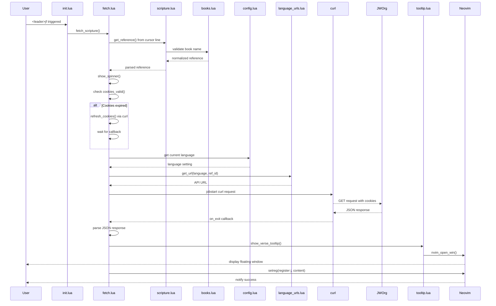
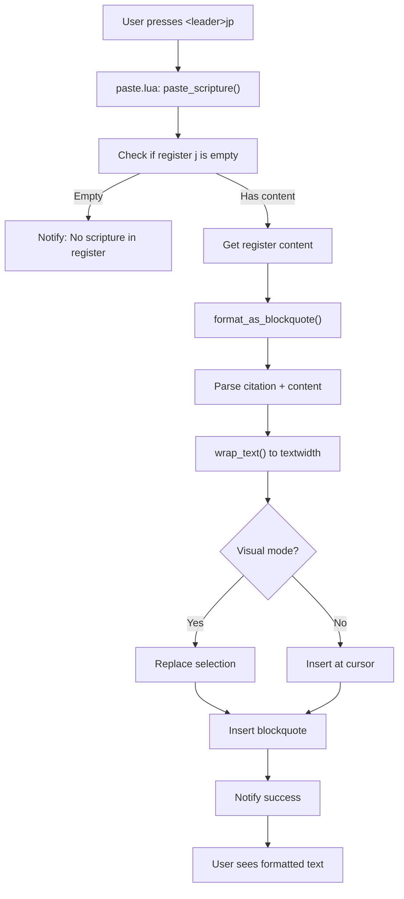
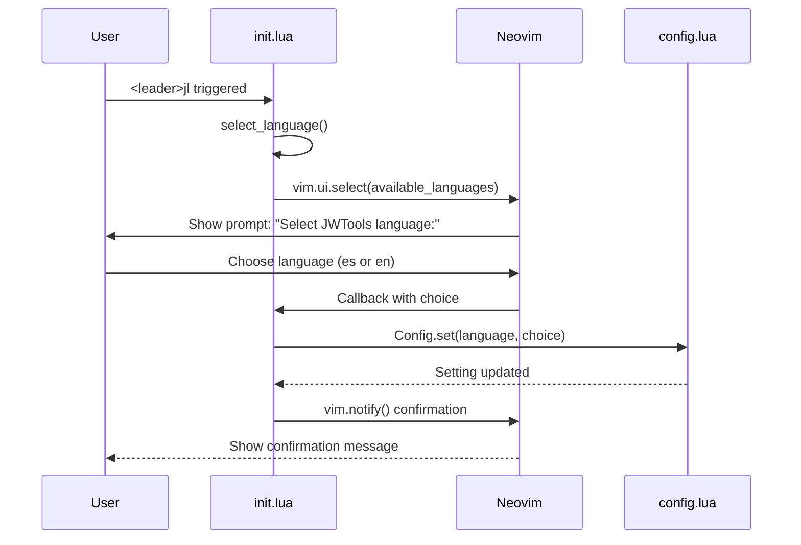
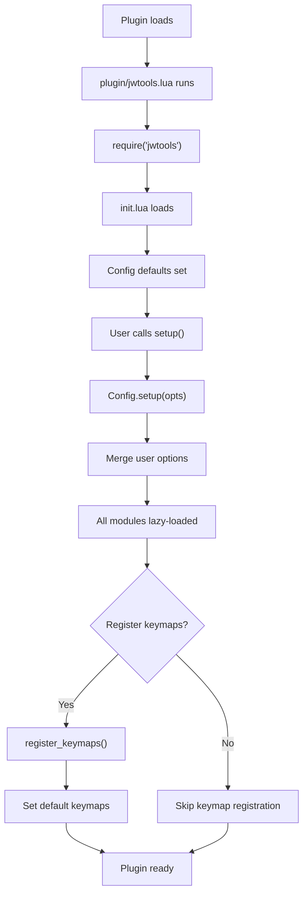

# Workflows

## Main User Workflows

### Workflow 1: Fetch and Display Scripture

**Entry Point**: User presses `<leader>jf`

**Sequence**:



**Steps**:

1. User is at a line containing a scripture reference (e.g., "John 3:16")
2. Presses `<leader>jf`
3. `fetch.lua` extracts reference from current line
4. `scripture.lua` parses the reference (e.g., "John" → "43", "3:16" → "3_16-16")
5. `books.lua` validates book name and returns canonical form
6. Checks if jw.org cookies are valid (< 1 hour old)
7. If expired, refreshes cookies by fetching jw.org homepage
8. Gets current language from config (default: Spanish)
9. Constructs API URL using language-specific pattern
10. Spawns curl as background job with jw.org cookies
11. Shows spinner animation while waiting
12. On success, parses JSON response
13. Displays verse in floating tooltip window
14. Stores formatted scripture in register "j" as: `**Citation**\n\nVerse content`
15. Notifies user of success

**Error Cases**:
- Invalid reference format → Notify and abort
- Invalid book name → Notify and abort
- Network failure → Retry with cookie refresh, then notify
- Malformed JSON response → Notify and abort

**Async Handling**: Entire HTTP request happens non-blocking, UI remains responsive

---

### Workflow 2: Yank Scripture (Without Display)

**Entry Point**: User presses `<leader>jy`

**Sequence**: Same as Workflow 1, but **skips** tooltip display
- No `show_verse_tooltip()` call
- Still stores content in register "j"
- Useful for silent background operation

---

### Workflow 3: Paste Scripture as Blockquote

**Entry Point**: User presses `<leader>jp`

**Sequence**:



**Steps**:

1. User presses `<leader>jp` (in normal or visual mode)
2. `paste.lua` retrieves stored scripture from register "j"
3. If register empty, warns user and aborts
4. Parses stored format: `**Citation**\n\nContent`
5. Formats as markdown blockquote:
   - Citation becomes: `> **Citation**`
   - Blank line
   - Verse lines wrapped to `textwidth`, each prefixed with `> `
6. In visual mode: replaces selected text with blockquote
7. In normal mode: inserts blockquote at cursor (new lines)
8. Text is wrapped respecting `textwidth` option (default 80)
9. Word boundaries are preserved during wrapping

**Example Output**:
```markdown
> **John 3:16-17**
>
> 16 For God loved the world so much that he
> gave his only-begotten Son, so that everyone
> exercising faith in him might not be
> destroyed but have everlasting life.
> 17 For God did not send his Son into the
> world for him to judge the world, but for
> the world to be saved through him.
```

---

### Workflow 4: Language Selection

**Entry Point**: User presses `<leader>jl`

**Sequence**:



**Steps**:

1. User presses `<leader>jl`
2. Shows interactive menu with available languages
3. User selects language
4. Updates config with new language setting
5. All subsequent fetch operations use new language
6. Confirmation notification shown
7. No restart required

**Available Languages**:
- es: Spanish (default)
- en: English

**Scope**: Global setting affects all future operations until changed

---

### Workflow 5: Plugin Setup

**Entry Point**: Plugin initialization (lazy.nvim or manual)

**Sequence**:



**Steps**:

1. Plugin loads (via lazy.nvim or require)
2. `plugin/jwtools.lua` requires the jwtools module
3. `init.lua` initializes with lazy-loading metatable
4. User calls `require("jwtools").setup(opts)`
5. Configuration merged with defaults (language: es, keymaps: true)
6. If keymaps enabled, registers default keymaps (jf, jy, jp, jl)
7. Modules lazy-loaded on first access (not all at startup)
8. Plugin fully initialized

**Configuration Options**:
```lua
require("jwtools").setup({
  language = "en",    -- Optional: switch to English
  keymaps = false     -- Optional: disable auto-keymaps
})
```

---

## Data Flow Diagrams

### Scripture Reference Parsing

```
Input: "John 3:16-18"
  ↓
[scripture.lua] Extract book name: "John"
  ↓
[books.lua] Lookup mapping: "John" → "43" (book code)
  ↓
[scripture.lua] Extract chapter: "3"
  ↓
[scripture.lua] Extract verses: "16-18"
  ↓
[scripture.lua] Merge/normalize: {start:16, end:18}
  ↓
Output: ref_id = "43_3_16-18"
```

### HTTP Request Cycle

```
[fetch.lua] Build URL from ref_id
  ↓ (language: "en")
[language_urls.lua] Format: https://www.jw.org/en/library/bible/study-bible/books/json/html/43_3_16-18
  ↓
[curl] Execute with jw.org cookies
  ↓
[jw.org API] Return JSON with verse content
  ↓
[fetch.lua] Parse JSON response
  ↓
{
  citation: "John 3:16-18",
  verses: [{content: "16 For God loved..."}, ...]
}
```

### Content Flow to Register

```
Verse JSON
  ↓
[fetch.lua] Extract citation + verses
  ↓
Format as:
  **John 3:16-18**
  
  16 For God loved...
  18 Everlasting life...
  ↓
[Neovim] setreg("j", formatted_content)
  ↓
Register j: [formatted content stored]
  ↓
[paste.lua] Read from register
  ↓
[paste.lua] Add blockquote formatting
  ↓
Output: > **John 3:16-18**
         >
         > 16 For God loved...
         > 18 Everlasting life...
```

---

## State Transitions

### Configuration State

```
Initial: { language: "es", keymaps: true }
  ↓ [User selects language: en]
Transition: { language: "en", keymaps: true }
  ↓ [All future fetches use English]
Subsequent: { language: "en", keymaps: true }
```

### Cookie State

```
Fresh Start: No cookies
  ↓ [First fetch]
Refresh: Fetch jw.org homepage
  ↓ [Store cookies]
Valid: Cookies exist and < 1 hour old
  ↓ [Use existing cookies]
Expired: Cookies > 1 hour old
  ↓ [Refresh cookies]
Refreshed: New cookies stored
```

### Register State

```
Empty: No previous fetch
  ↓ [User: <leader>jf John 3:16]
Stored: Register j contains formatted scripture
  ↓ [User: <leader>jp]
Inserted: Blockquote pasted into buffer
  ↓ [Register unchanged]
Still Stored: Can paste again
```

---

## Error Handling Flows

### Invalid Reference Format

```
User at line: "Some random text"
  ↓
[scripture.lua] get_reference() → nil
  ↓
[fetch.lua] Abort with notification
  ↓
User sees: "JWTools: Failed to parse scripture reference"
```

### Network Failure

```
[fetch.lua] Spawn curl
  ↓
[curl] Network timeout/error
  ↓
[on_exit callback] Exit code != 0
  ↓
[fetch.lua] Attempt refresh_cookies()
  ↓
[curl] Cookie refresh fails
  ↓
User sees: "Failed to refresh cookies"
```

### Missing Register Content

```
[paste.lua] paste_scripture()
  ↓
[getreg("j")] Returns empty string
  ↓
[paste.lua] Check: content == ""
  ↓
User sees: "No scripture in register. Use <leader>jf or <leader>jy first."
```
